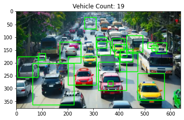
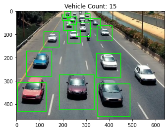

# Download Car Images

```py
!wget https://miro.medium.com/max/640/1*0YyilCiA-lKLNNTZ1QO6rw.webp -O car22.jpeg
!wget https://miro.medium.com/max/640/1*N_FUmoCqT98ZwWVLxdeZZg.webp -O car29.jpeg
```

# Download Car Classifier Model

```py
# cars.xml file from https://github.com/afzal442/Real-Time_Vehicle_Detection-as-Simple/blob/master/cars.xml
!wget https://raw.githubusercontent.com/afzal442/Real-Time_Vehicle_Detection-as-Simple/master/cars.xml -O cars.xml
```

# Detect Car in Images

```py
import cv2
import matplotlib.pyplot as plt

# Colors
GREEN = (0, 255, 0)

# Configuration Car Size
min_width  = 80
min_height = 80

# Create Car Classifier
CLF = cv2.CascadeClassifier('cars.xml')

def detect_car_model(image_bgr):
    result = cv2.cvtColor(image_bgr, cv2.COLOR_BGR2RGB)
    gray   = cv2.cvtColor(image_bgr, cv2.COLOR_BGR2GRAY)
    blur   = cv2.GaussianBlur(gray, (3, 3), 5)

    # Pass frame to our car classifier
    cars = CLF.detectMultiScale(
        blur, 
        scaleFactor = 1.1,    # how much the image size is reduced at each image scale
        minNeighbors = 2,     # how many neighbors each candidate rectangle should have to retain it
    )

    # Extract bounding boxes for any car identified
    for x, y, w, h in cars:
        cv2.rectangle(result, (x, y), (x + w, y + h), GREEN, 2)

    plt.imshow(result)
    plt.title(f"Vehicle Count: {len(cars)}")
    plt.show()
```

# Test Function

```py
image = cv2.imread('car29.jpeg')
detect_car_model(image)

image = cv2.imread('car22.jpeg')
detect_car_model(image)
```

# Result

| Image 1 | Image 2 |
|:----------:|:----------:|
|  |  |
| Car22.jpeg | Car29.jpeg |

# Resources

- [Image dataset](https://www.kaggle.com/datasets/sshikamaru/car-object-detection)
- [detect multiscale using opencv](https://stackoverflow.com/questions/36218385/parameters-of-detectmultiscale-in-opencv-using-python)
- [background subtraction](https://www.geeksforgeeks.org/python-opencv-background-subtraction/)# Car-Detection-Project
